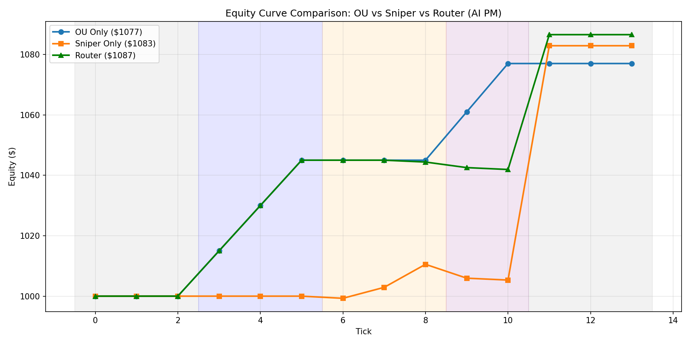

````markdown
# AI Quant Router

多策略量化交易路由框架，用于模拟**预测市场套利 + 狙击策略**，并预留接入 AI Agent（Gemini / LLM）作为“策略中枢”（AI PM）的接口。

当前版本聚焦于：

- OU 均值回归套利（跨平台价差：例如 Polymarket vs Opinion）
- Sniper 狙击策略（相信一个“合理价”，低估就买入）
- 纯逻辑 `StrategyRouter`（在不同市场状态下在两种策略之间切换）
- 回测引擎 + 策略对比 Demo（`demo_compare_strategies.py`）
- 预留 AI PM 接口（当前是规则 stub，将来可换成真实 Gemini API 调用）

---

## 背景 / Motivation

预测市场（如 Polymarket 等）在宏观事件、美股、加密等赛道越来越活跃，但现实里常见几个问题：

- 脚本大多是**单一策略 + 单文件**：要么只做套利，要么只做方向，很难适配不同市场状态；
- 很多代码是“一坨 core.py 糊到底”，**难以复用、难以扩展、多策略很痛苦**；
- 新一代 AI Agent / LLM（Gemini、ChatGPT 等）已经可以理解市场上下文，但缺少一个 **干净、可插拔的“策略路由层”** 来控制真实资金/指令。

本项目的目标是搭建一个**小而工程化的多策略交易路由框架**：

- 底层有独立的策略模块：  
  - OU 均值回归套利（跨平台价差，买便宜卖贵）
  - Sniper 狙击策略（认为“合理价格”，出现明显低估时进场）
- 中间有纯逻辑 `StrategyRouter`，只关心：  
  > “在当前 market_state 下应该调用哪一种策略？”
- 顶层预留 AI PM 接口：  
  - 目前用规则 stub（`decide_strategy(stats)`）模拟  
  - 未来可以替换为 Gemini / 任意 LLM，通过 API 接管“调度大脑”。

---

## 项目结构 / Architecture

当前仓库的核心结构（简化）大致如下：

```text
ai_quant_router/
├── infra/                 # 基础设施：日志、风控等（未来可扩展）
│
├── strategies/            # 【策略层】纯逻辑，无 IO / 无 Web3
│   ├── base.py            # BaseStrategy 接口 + OrderInstruction 数据结构
│   ├── ou_arb.py          # OUArbStrategy：均值回归套利（跨平台价差）
│   ├── sniper.py          # SniperStrategy：狙击策略（低估时买入）
│   ├── router.py          # StrategyRouter：在多策略之间做路由
│   └── ai_pm.py           # AI PM stub：decide_strategy(stats) -> dict
│
├── engine/                # 【引擎层】驱动策略跑起来
│   └── backtest.py        # BacktestEngine：按时间序列喂 market_state，执行策略指令
│
├── router/                # （可选）未来可放更高级的路由/Agent 逻辑
│
├── demo_compare_strategies.py  # Demo 脚本：对比 OU / Sniper / Router 行为与收益
├── equity_comparison.png       # Demo 生成的权益曲线对比图
├── main_demo.py                # 其他实验入口（可选）
└── test/                       # 测试脚本（unit tests / demo tests）
````

可以抽象成这样一张流程示意图：

```text
市场数据 (market_state 时间序列)
          |
          v
     BacktestEngine
          |
          v
   +------------------+
   |  StrategyRouter  |
   +------------------+
       /          \
      v            v
OUArbStrategy   SniperStrategy
  (套利风格)      (狙击风格)
   |            |
   +------ 订单指令 ------+
                |
                v
        回测执行 & 统计（equity 曲线、PnL、行为日志）
```

> 关键设计点：
>
> * 策略是 **“纯函数风格”**：输入 market_state，输出 OrderInstruction 列表；
> * Router/AI PM 只决定“用哪个策略”，而不直接操作链或资金；
> * 将来把 AI 插进来，只需要替换 `decide_strategy(stats)`，不需要重写策略。

---

## 快速开始 / Quickstart

> 说明：下面先写一个能跑 Demo 的最小流程，后续可以再根据实际依赖补充 `requirements.txt` / 一键脚本。

### 1. 克隆项目

```bash
git clone <your_repo_url>
cd ai_quant_router
```

### 2. 创建虚拟环境（可选但推荐）

```bash
python3 -m venv .venv
source .venv/bin/activate      # Windows: .venv\Scripts\activate
```

### 3. 安装依赖

如果你已经写好了 `requirements.txt`，可以这样：

```bash
pip install -r requirements.txt
```

如果还没有，先简单说明一下当前状态：

> TODO:
>
> * 当前版本主要使用 Python 3.10+ 标准库
> * 如果你使用了 `matplotlib` 绘制 `equity_comparison.png`，可以手动安装：
>
>   ```bash
>   pip install matplotlib
>   ```
> * 后续会整理出完整的 `requirements.txt`。

### 4. 运行策略对比 Demo

```bash
python demo_compare_strategies.py
```

预期行为（根据你目前的实现，可略调）：

* 控制台打印不同阶段的市场状态和三种模式的决策：

  * **OU Only**：只运行 OU 套利策略
  * **Sniper Only**：只运行狙击策略
  * **Router**：由 `StrategyRouter`（内部调用 `ai_pm.decide_strategy`）决定用哪一个
* 在项目根目录生成一张对比图，比如：`equity_comparison.png`，用于展示不同模式下的权益曲线。

---

## 策略说明（简要）

### OUArbStrategy（ou_arb.py）

* 场景：跨平台预测市场价差套利（例如 Polymarket vs 第二个平台）
* 核心逻辑（简化）：

  * 从 `market_state` 读取：

    * `pm_ask`（在便宜的一侧买）
    * `op_bid`（在贵的一侧卖）
  * 计算：

    ```text
    gross_spread = op_bid - pm_ask
    spread_pct   = gross_spread / pm_ask
    ```
  * 如果 `spread_pct` 超过某个最小收益阈值（如 `min_profit_rate`），则：

    * 下达两条指令：

      * 在便宜平台 `BUY`
      * 在贵的平台 `SELL`

> 在当前版本中：
>
> * 不考虑链上 Gas、滑点、可执行性等细节（这些应由执行层 / 真实交易引擎处理）；
> * 策略是“纯判断”，只负责回答：“要不要出手？方向和大致 size 是什么？”

### SniperStrategy（sniper.py）

* 场景：单边狙击逻辑（“我认为合理价格是 `target_price`，低于一定幅度就买入”）
* 核心逻辑（简化）：

  * 从 `market_state` 读取：

    * `current_ask`：当前卖价（买入成本）
    * `gas_cost_usd`：预估 Gas 成本（用于粗略算盈利空间）
  * 核心判断：

    ```text
    price_gap = target_price - current_ask
    has_opportunity = (
        price_gap >= min_price_gap
        and expected_profit > 0
        and current_ask > 0
    )
    ```
  * 满足条件时返回一条 `BUY` 指令。

> 当前版本依然保持“策略只做判断，不关心账户状态、交易签名、链上交互”，这些均交由外层路由 / 账户模块来处理。

### StrategyRouter（router.py）

* 实现了 `BaseStrategy` 接口，但内部不直接做交易逻辑，而是做“**分流**”：

  * 构造时持有：

    * 一个 `OUArbStrategy` 实例
    * 一个 `SniperStrategy` 实例
  * 在 `on_tick(market_state)` 中：

    * 调用 `ai_pm.decide_strategy(stats)`（目前是规则 stub，未来可替换为真实 AI）
    * 根据返回的 `chosen_strategy`（如 `"ou_arb"` / `"sniper"`）选择具体策略
    * 将同一个 `market_state` 传给被选中的策略
    * 收集并返回该策略输出的 `OrderInstruction` 列表

> 这样设计的好处是：
>
> * Router 本身不用变成“巨型 if/else 怪物”；
> * 将来如果有新的策略（做市、相关性对冲、流动性尖峰回归……），只需要：
>
>   * 在 `strategies/` 中新增一个类
>   * 在 Router + AI PM 的映射逻辑中注册即可。

### AI PM Stub（ai_pm.py）

* 暂时是一个“假装 AI 的小脑袋”，函数形式大致为：

```python
def decide_strategy(stats: Dict[str, Any]) -> Dict[str, Any]:
    """
    目前内部使用硬编码规则，例如：
    - 如果 stats["mode"] == "arb"    -> 选择 ou_arb
    - 如果 stats["mode"] == "sniper" -> 选择 sniper
    - 否则走默认模式（如 ou_arb）
    将来可以替换为真正的 LLM / Gemini 调用。
    """
```

* Router 当前逻辑大致为：

  1. 把当期 market_state 或统计信息 `stats` 传给 `decide_strategy`
  2. 根据返回的 `"chosen_strategy"` 字段决定调用 OU 或 Sniper
  3. 可以把 `"reason"` / `"risk_mode"` 等字段写入日志或订单 `meta` 信息里，方便分析。

---

## 实验结果（示意）

当前仓库中包含一个 Demo 对比脚本：`demo_compare_strategies.py`。

该脚本会构造一段“分阶段”的合成市场数据：

* Phase A（安静期）：价差不大，`mode = "neutral"`
  → 三个策略都应该大多保持观望；
* Phase B（套利窗口）：`op_bid` 明显高于 `pm_ask`，`mode = "arb"`
  → OU 策略出手，Router 也应该通过 OU 分支出手；
* Phase C（狙击窗口）：某一侧价格明显低估，`mode = "sniper"`
  → Sniper 出手，Router 通过 Sniper 分支出手；
* Phase D（切回）：回到套利逻辑或中性状态。

回测结束后，会生成一张类似这样的权益对比图：



简单解读（可以根据你真实图像稍后再改）：

* **单独 OU 策略**：

  * 在套利阶段权益曲线会出现阶梯上升；
  * 在非套利段基本横盘或少动作。
* **单独 Sniper 策略**：

  * 在“明显低估”阶段有一次或多次突刺；
  * 在非趋势段可能久等不动。
* **Router 模式**：

  * 能在各自擅长的阶段借用对应策略；
  * 理想情况下，权益曲线会比单一策略更平滑，使用效率也更高。

---

## Roadmap / 下一步计划

短期（Hackathon 阶段）目标：

* [x] 抽离 OU 套利 & Sniper 策略为独立模块
* [x] 实现纯逻辑 `BacktestEngine` + `StrategyRouter`
* [x] 加入 AI PM stub（`decide_strategy(stats)`）
* [x] Demo 对比脚本（`demo_compare_strategies.py` + `equity_comparison.png`）
* [ ] 整理 `requirements.txt` + 一键运行脚本（如 `python main_demo.py`）
* [ ] 接入真实预测市场历史数据（Polymarket / 其他）
* [ ] 将 AI PM stub 替换为真实 Gemini / LLM 调用（作为“策略中枢”）

中期目标：

* 支持更多策略家族：

  * 做市 / 流动性提供
  * 相关性对冲
  * 流动性尖峰回归（黑天鹅 + 异常成交量下的均值回归机会）
* 增加风险管理模块：

  * 最大回撤控制
  * 仓位上限、单策略权重配比
  * 交易频率限制等
* 提供简单的可视化界面：

  * Web Dashboard 或 Notebook 报告
  * 策略表现对比、参数敏感性分析等。

---

## 声明 / Disclaimer

本项目目前是一个研究 / Hackathon 原型：

* 不直接连接真实资金账户；
* 不包含实际 Web3 交易执行逻辑（签名、RPC、链上安全相关）；
* 任何基于本项目扩展到真实交易环境的行为，风险自负。

```

