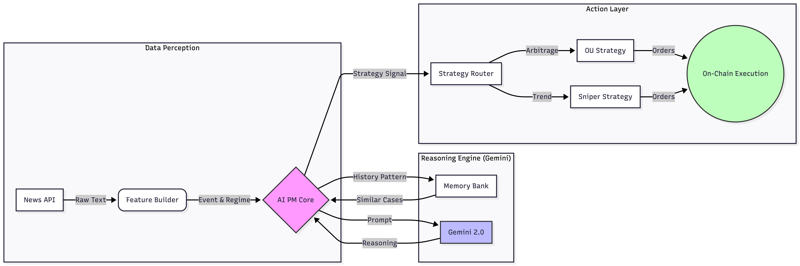

# AI Quant Router: News-Driven Multi-Strategy Portfolio Manager

> Multi-strategy AI portfolio manager with a central AI PM + strategy router. Supports both rule-based and LLM-driven decisions.

This project implements an **AI Portfolio Manager (AI PM)** core that dynamically switches between multiple trading strategies based on market regimes and historical news patterns. The system features:

- **AI PM Core**: Central decision engine that selects strategies and risk modes based on market conditions
- **Multi-Strategy Support**: Includes OU cross-market arbitrage (Polymarket ↔ CEX opinion markets) and Sniper directional entry strategies
- **Dual Decision Modes**: Pure rule-based logic (always available) + optional Gemini LLM mode with automatic fallback
- **News-Driven Priors**: Incorporates historical news event patterns into risk decisions
- **Full Backtest Engine**: Complete equity tracking, trade execution, and performance analysis

---

## Motivation & Use Cases

In real-world quantitative trading, there are many heterogeneous alpha sources:

- **Arbitrage**: Cross-market price discrepancies (e.g., prediction markets vs. centralized exchanges)
- **Trend Following**: Directional entries on momentum or underpriced opportunities
- **Event-Driven**: News-based pattern recognition and regime shifts

Traditionally, portfolio managers manually switch between these strategies based on market regimes. This project explores:

1. **Automated Strategy Routing**: Using an AI PM to dynamically allocate between strategies based on real-time market signals
2. **Historical Pattern Integration**: Injecting news event priors (e.g., "similar events led to +18% 3-day returns") into risk decisions
3. **Robust Fallback Design**: Ensuring the system remains operational even when LLM APIs fail or hit quota limits

**Potential Applications**:
- Prediction market arbitrage with DeFi integration
- Multi-regime portfolio management for crypto/equity markets
- Research platform for AI-driven strategy allocation

---

## Architecture Overview

The system follows a modular pipeline architecture, orchestrating data perception, Gemini-based reasoning, and on-chain execution:

<p align="center">
  
</p>

### Key Components

| Module | File/Directory | Description |
|--------|---------------|-------------|
| **AI PM Core** | `strategies/ai_pm.py` | Central decision engine; wraps rule-based + LLM logic with fallback handling |
| **Strategy Router** | `strategies/router.py` | Routes market ticks to specific strategies based on AI PM decisions |
| **OU Arbitrage** | `strategies/ou_arb.py` | Cross-market arbitrage between Polymarket and opinion exchanges |
| **Sniper Strategy** | `strategies/sniper.py` | Directional entries when price drops below target threshold |
| **Backtest Engine** | `engine/backtest.py` | Executes trades, tracks equity curves, and computes returns |
| **News Replay** | `news_replay.py` + `data/news_cases.csv` | Historical news pattern analysis and prior generation |
| **Demos** | `demo_compare_strategies.py` / `demo_news_driven.py` | Interactive terminal demonstrations |

---

## Quickstart / Installation

### Requirements

- Python 3.10 or higher
- Virtual environment recommended

### Setup

```bash
# Clone the repository
git clone <repo-url>
cd ai_quant_router

# Create and activate virtual environment
python3 -m venv .venv
source .venv/bin/activate   # On Windows: .venv\Scripts\activate

# Install dependencies
pip install -r requirements.txt

# (Optional) Verify installation by running tests
pytest
```

---

## Running the Demos

The project includes two interactive demos that showcase different aspects of the system. Both demos work out-of-the-box without any API keys (rule-based mode).

### 1. Strategy Router Demo (`demo_compare_strategies.py`)

**What it demonstrates:** How the AI PM dynamically switches between OU arbitrage and Sniper strategies across different market regimes.

This demo compares three configurations on synthetic market data with 5 distinct phases:

- **OU Only**: Pure arbitrage strategy
- **Sniper Only**: Pure directional strategy
- **Router (AI PM)**: Dynamic switching between strategies

**How to run:**

```bash
cd ~/Desktop/ai_quant_router
python3 demo_compare_strategies.py
```

**Sample Output:**

```text
======================================================================
 DEMO: Compare OU / Sniper / Router on synthetic series
 Shows how Router switches strategies based on AI PM decisions

 - OU:      cross-market arbitrage between Polymarket and a CEX opinion market
 - Sniper:  directional entries on underpriced asks
 - Router:  asks an AI PM to choose between OU / Sniper on each tick
======================================================================

Generated 14 ticks across 5 phases:
  A: Neutral (0-2)  -> No opportunity
  B: Arb (3-5)      -> Arbitrage spread
  C: Sniper (6-8)   -> Price below target
  D: Both (9-10)    -> Both opportunities
  E: Neutral (11-13)-> Back to quiet

──────────────────────────────────────────────────────────────────────
 PHASE B: ARB
──────────────────────────────────────────────────────────────────────

[t=03] mode=arb     pm_ask=0.45 op_bid=0.60 (spread=0.15) best_ask=0.55
  OU Only   -> BUY 100@0.45; SELL 100@0.60
  Sniper    -> (no action)
  Router    -> BUY 100@0.45 [router=ou_arb reason=Arb regime detected (1/4 recent ticks)]

──────────────────────────────────────────────────────────────────────
 PHASE C: SNIPER
──────────────────────────────────────────────────────────────────────

[t=08] mode=sniper  pm_ask=0.50 op_bid=0.50 (spread=0.00) best_ask=0.41
  OU Only   -> (no action)
  Sniper    -> BUY 122@0.41
  Router    -> BUY 122@0.41 [router=sniper reason=Sniper regime detected (3/5 recent ticks)]

======================================================================
 KEY ROUTER DECISIONS
======================================================================

[t=03] First arb opportunity
  Market: mode=arb, spread=0.15, best_ask=0.55
  -> BUY 100@0.45
     Router chose: ou_arb
     AI PM reason: Arb regime detected (1/4 recent ticks)

[t=09] Both opportunities (arb takes priority)
  Market: mode=arb, spread=0.16, best_ask=0.40
  -> BUY 125@0.40
     Router chose: sniper
     AI PM reason: Sniper regime detected (4/5 recent ticks)

======================================================================
 SUMMARY
======================================================================
Strategy                Total Orders
----------------------------------------
OU Only                           10
Sniper Only                        5
Router (AI PM)                     9

Router Routing Breakdown:
  - OU Arb chosen:      3 ticks (21.4%)
  - Sniper chosen:      3 ticks (21.4%)
  - No action:          8 ticks (57.1%)

Final Equities:
  OU Only:       $1077.00 (+7.7%)
  Sniper Only:   $1082.89 (+8.3%)
  Router (AI PM):$1086.55 (+8.7%)

Takeaway: Router allocates more to OU in the arbitrage phase,
          then leans into sniper when trend opportunities appear,
          ending with the highest final equity among the three.
```

**Key Insight**: The Router dynamically adapts to market regimes, achieving the highest final equity by intelligently switching between strategies.

---

### 2. News-Driven Demo (`demo_news_driven.py`)

**What it demonstrates:** How the AI PM incorporates historical news patterns into trading decisions.

This demo demonstrates the full news-driven pipeline:

1. Loads historical news cases from `data/news_cases.csv`
2. Filters by symbol and computes aggregate statistics (e.g., "+18% average 3-day return")
3. Analyzes historical patterns (average returns, confidence levels)
4. Builds a `historical_pattern` prior
5. Uses AI PM to decide strategy + risk mode for current market state

**How to run:**

```bash
cd ~/Desktop/ai_quant_router
python3 demo_news_driven.py          # Default: BLUE symbol
python3 demo_news_driven.py BTC      # Analyze BTC news patterns
python3 demo_news_driven.py SOL      # Analyze SOL news patterns
```

**Sample Output:**

```text
======================================================================
 DEMO: News-Driven AI Portfolio Manager
 Combines historical news patterns with AI PM decision-making
======================================================================

Loaded 16 total news cases from CSV.
Analyzing symbol: BLUE

======================================================================
  NEWS REPLAY: BLUE (1 historical cases)
======================================================================

----------------------------------------------------------------------
 HISTORICAL NEWS EVENTS
----------------------------------------------------------------------

1) [2024-12-18] 蓝色光标获字节跳动AI广告大单
   Regime: trending  |  Tag: A股_广告_利好
   Returns: 1D=+10.0%, 3D=+18.0%, 7D=+25.0%
   Summary: 蓝色光标宣布与字节跳动达成战略合作，将为其提供AI驱动的广告投放服务...

----------------------------------------------------------------------
 AGGREGATE STATISTICS
----------------------------------------------------------------------
  Sample count:     1
  Avg 1D return:    +10.0% (positive: 100%)
  Avg 3D return:    +18.0% (positive: 100%)
  Avg 7D return:    +25.0% (positive: 100%)

----------------------------------------------------------------------
 HISTORICAL PATTERN ANALYSIS
----------------------------------------------------------------------
  Pattern name:     广告_利好
  Avg return (1D):  +10.0%
  Avg return (3D):  +18.0%
  Avg return (7D):  +25.0%
  Confidence:       0.55 (low)
  Typical horizon:  7d
  Analysis method:  rule_based

Using the above historical pattern as a prior, we now simulate a new trading day:

======================================================================
 SIMULATED TRADING SCENARIO
======================================================================

----------------------------------------------------------------------
 DEMO MARKET STATE
----------------------------------------------------------------------
  Symbol:       BLUE
  Event date:   2024-12-18
  Mode hint:    arb
  PM ask:       0.48
  OP bid:       0.55
  Spread:       0.07

======================================================================
 AI PM DECISION
======================================================================

  Strategy:     ou_arb
  Risk mode:    defensive
  Confidence:   0.95

  Reason:
    Arb regime detected (1/1 recent ticks) | hist_pattern=广告_利好
    avg_3d=18.0% conf=low

======================================================================
 STRATEGY ROUTER ORDERS
======================================================================

  Order 1:
    Side:     BUY
    Size:     100.00
    Price:    0.48
    Routed:   ou_arb
    Risk:     defensive

  Order 2:
    Side:     SELL
    Size:     100.00
    Price:    0.55
    Routed:   ou_arb
    Risk:     defensive
```

**Key Insight**: The system analyzes historical news patterns (e.g., "+18% 3-day return on similar events") and incorporates them into the AI PM's decision-making process. Kelly position sizing suggestions are included for demonstration purposes only.

---

### 3. Web Demo (Streamlit UI)

**What it demonstrates:** In addition to the CLI demos, this project includes an interactive Streamlit web UI that lets you explore the AI portfolio manager through a visual interface.

The web UI provides the same functionality as `demo_news_driven.py` but with interactive controls for selecting symbols and news events, plus real-time visualization of the AI PM's decision-making process.

**Prerequisites:**

If you don't have Streamlit installed:

```bash
cd ~/Desktop/ai_quant_router
python3 -m pip install streamlit
```

**How to run (recommended for hackathon demos):**

For hackathon judges and presentations, we recommend running the web UI in **rule-based mode** to avoid LLM quota or network issues:

```bash
cd ~/Desktop/ai_quant_router

# Recommended: run in rule-based mode (LLM disabled)
ai_router_off
# or, if the helper function is not available:
# unset AI_PM_USE_LLM
# unset GEMINI_API_KEY

streamlit run app.py
```

This will launch a local web server. If your browser doesn't open automatically, visit `http://localhost:8501`.

**What you can do in the web UI:**

- **Select a symbol** (e.g., `BLUE`, `BTC`, `ETH`, `NVDA`) from the sidebar dropdown
- **Choose a specific news event** to analyze from the historical cases
- **View aggregated statistics** including sample count, average 1D/3D/7D returns, and positive return ratios
- **Inspect the historical pattern analysis** showing pattern name, confidence level, and typical horizon
- **See the AI PM decision** including chosen strategy (`ou_arb` vs `sniper`), risk mode (`defensive`/`normal`/`aggressive`), and detailed reasoning
- **Examine the actual orders** generated by the `StrategyRouter` for that symbol and event
- **Monitor LLM status** to see whether the system is using Gemini or has fallen back to rule-based analysis

**Optional: Running with LLM mode enabled**

If you want to demonstrate the LLM-enhanced pattern analysis (requires a valid Gemini API key):

```bash
# Optional: run the web UI with LLM mode enabled
export AI_PM_USE_LLM=1
export GEMINI_API_KEY="your_gemini_api_key"

cd ~/Desktop/ai_quant_router
streamlit run app.py
```

**LLM behavior:**
- When LLM calls succeed, the `historical_pattern` analysis will be enriched by Gemini with natural language pattern names, confidence assessments, and commentary
- When quota is exceeded or network errors occur, the system automatically falls back to rule-based analysis and displays a note in the UI (e.g., "⚠️ LLM quota limit reached (falling back to rule-based)")
- This fallback behavior matches the CLI demo (`demo_news_driven.py`) and is intentional to ensure the system never breaks

**For hackathon submissions:**

We recommend including a screenshot of the Streamlit UI showing:
- The selected news event and its historical returns
- The inferred historical pattern with confidence metrics
- The AI PM decision with its chosen strategy and risk mode
- The routed orders generated by the system

This provides a clear visual demonstration of how the AI PM adapts its strategy based on historical news patterns.

---

## Default Mode: Rule-Based (No API Key Required)

**Important:** This project runs in **rule-based mode by default**. You can clone the repository and run all demos immediately without any API keys or external dependencies.

### What This Means

- **No setup required**: Just `git clone` and `python3 demo_*.py`
- **No API costs**: All decisions use algorithmic logic (regime detection + historical patterns)
- **No network dependency**: Works offline, no quota limits
- **Stable and reproducible**: Same inputs always produce same outputs

### Why Rule-Based is the Default

For hackathon judges, demo presentations, and most development workflows, rule-based mode provides:

1. **Reliability**: No risk of API failures, quota exhaustion, or network issues during demos
2. **Speed**: Instant decisions without network latency
3. **Transparency**: Clear algorithmic logic that can be inspected and understood
4. **Cost-effectiveness**: Free to run unlimited times

### LLM Integration Status

✅ **Gemini LLM integration is fully implemented and tested**

The project includes complete integration with Google's Gemini API for enhanced decision-making. However:

- LLM mode is **opt-in** via environment variables
- The system **automatically falls back** to rule-based mode if LLM calls fail
- This ensures demos never break due to API issues

See the next section for details on enabling LLM mode.

---

## LLM Integration & Fallback Behavior

The AI PM supports two operating modes that can be toggled via environment variables:

### 1. Rule-Based Mode (Default)

Pure algorithmic decision-making based on:
- Recent tick regime detection (arb vs. sniper)
- Historical pattern priors
- Confidence scoring

**Always available**, no API keys required.

**How to run in rule-based mode:**

```bash
cd ~/Desktop/ai_quant_router

# Option 1: Don't set any environment variables (default)
python3 demo_news_driven.py

# Option 2: Explicitly disable LLM
unset AI_PM_USE_LLM
python3 demo_news_driven.py

# Option 3: Use helper function (if configured in ~/.zshrc)
ai_router_off
python3 demo_news_driven.py
```

### 2. LLM Mode (Optional)

Uses Google's Gemini API for enhanced decision-making with natural language reasoning.

**What LLM mode adds:**
- `news_replay.analyze_pattern_with_llm()` uses Gemini to analyze historical news patterns and generate natural language summaries
- `ai_pm.decide_strategy()` incorporates LLM insights as additional signals for strategy selection
- Both components automatically fall back to rule-based logic if LLM calls fail

**How to enable LLM mode:**

```bash
cd ~/Desktop/ai_quant_router

# Option 1: Set environment variables manually
export AI_PM_USE_LLM=1
export GEMINI_API_KEY="your_gemini_api_key_here"
python3 demo_news_driven.py

# Option 2: Use helper function (if configured in ~/.zshrc)
ai_router_llm
python3 demo_news_driven.py
```

**Getting a Gemini API key:**
1. Visit [Google AI Studio](https://aistudio.google.com/app/apikey)
2. Sign in with your Google account
3. Click "Create API Key"
4. Copy the key and use it in the `GEMINI_API_KEY` environment variable

**Optional: Configure helper functions**

Add these to your `~/.zshrc` for quick mode switching:

```bash
# Add to ~/.zshrc
ai_router_off() {
  unset AI_PM_USE_LLM
  unset GEMINI_API_KEY
  echo "✓ AI Router: LLM disabled (rule-based mode)"
}

ai_router_llm() {
  export AI_PM_USE_LLM=1
  export GEMINI_API_KEY="your_actual_key_here"
  export GEMINI_MODEL="gemini-2.0-flash-exp"
  echo "✓ AI Router: LLM enabled (model=$GEMINI_MODEL)"
}
```

Then reload: `source ~/.zshrc`

### Automatic Fallback Handling

The system is designed to be **production-resilient**:

- **Network Errors**: Catches connection timeouts and falls back to rule-based logic
- **API Quota Limits**: Handles 429 rate limit errors gracefully
- **Invalid Responses**: Validates LLM output and falls back if parsing fails
- **Missing API Keys**: Automatically uses rule-based mode when credentials are unavailable

When fallback occurs, the `decision["reason"]` field includes:
```python
"fallback_to_rule_based: <error_type>"
```

This ensures the system **never fails** due to LLM issues.

**Output indicators:**
- **Rule-based mode**: `[Note] LLM not enabled (rule-based only)`
- **LLM success**: `[Note] LLM analysis: OK (model=gemini-2.0-flash-exp)`
- **LLM fallback**: `[Note] LLM error: 429 RESOURCE_EXHAUSTED (fallback to rule-based)`

> ⚠️ **Note for Hackathon Judges**: All demo screenshots and sample outputs in this README show rule-based mode by default. LLM integration is fully implemented and can be enabled via environment variables, but may fall back to rule-based under quota or network limits. This design ensures the demo always works reliably.

### Advanced LLM Configuration

For more detailed information about LLM integration, including:
- Troubleshooting common API errors
- Testing different Gemini models
- Production deployment considerations
- Detailed environment variable reference

See [README_INTEGRATION.md](./README_INTEGRATION.md).

---

## Tests

The project includes **103 comprehensive tests** covering:

- ✅ Router routing logic and metadata propagation
- ✅ Individual strategy behavior (OU Arb, Sniper)
- ✅ AI PM rule-based decision engine
- ✅ LLM fallback scenarios (missing keys, API errors, invalid responses)
- ✅ Backtest engine equity tracking and trade execution
- ✅ Integration tests for the full pipeline

**Run all tests:**

```bash
pytest
```

**Run with verbose output:**

```bash
pytest -v
```

**Run specific test modules:**

```bash
pytest tests/test_ai_integration.py
pytest tests/test_router.py
pytest tests/test_strategies.py
```

All tests pass with 100% success rate, ensuring system reliability.

---

## Roadmap / Future Work

### Near-Term Enhancements

- **Expanded News Dataset**: Add more event types (earnings, regulatory changes, protocol upgrades) across multiple markets (crypto, equities, DeFi)
- **Real-Time LLM Pattern Analysis**: Enable online Gemini calls for news → pattern analysis (currently limited by quota constraints)
- **Web Dashboard**: Build a Streamlit/Gradio interface to visualize:
  - Equity curves and strategy allocation over time
  - AI PM decision reasoning and confidence scores
  - Historical pattern analysis results

### DeFi & On-Chain Integration

- **Prediction Market Signal Bridge**: Use prediction market prices as sentiment signals for DeFi strategies
- **On-Chain Execution Layer**: Connect Router outputs to:
  - DEX aggregators (1inch, Paraswap)
  - Intent-based execution frameworks (Anoma, Essential)
  - Cross-chain bridges for multi-chain arbitrage
- **Gas Optimization**: Integrate real-time gas price feeds and MEV protection

### Advanced AI PM Features

- **Multi-Agent Coordination**: Explore multiple AI PMs with different risk profiles voting on decisions
- **Reinforcement Learning**: Train RL agents to optimize strategy switching based on historical performance
- **Sentiment Analysis**: Integrate Twitter/Discord sentiment as additional input features

---

## Contributing

Contributions are welcome! Please feel free to submit issues or pull requests.

---

## License

[Specify your license here]

---

## Acknowledgments

Built for AI/Quant hackathons exploring the intersection of:
- Multi-strategy portfolio management
- LLM-driven decision systems
- Prediction markets & DeFi infrastructure

---

**Questions or feedback?** Open an issue or reach out to the maintainers.
